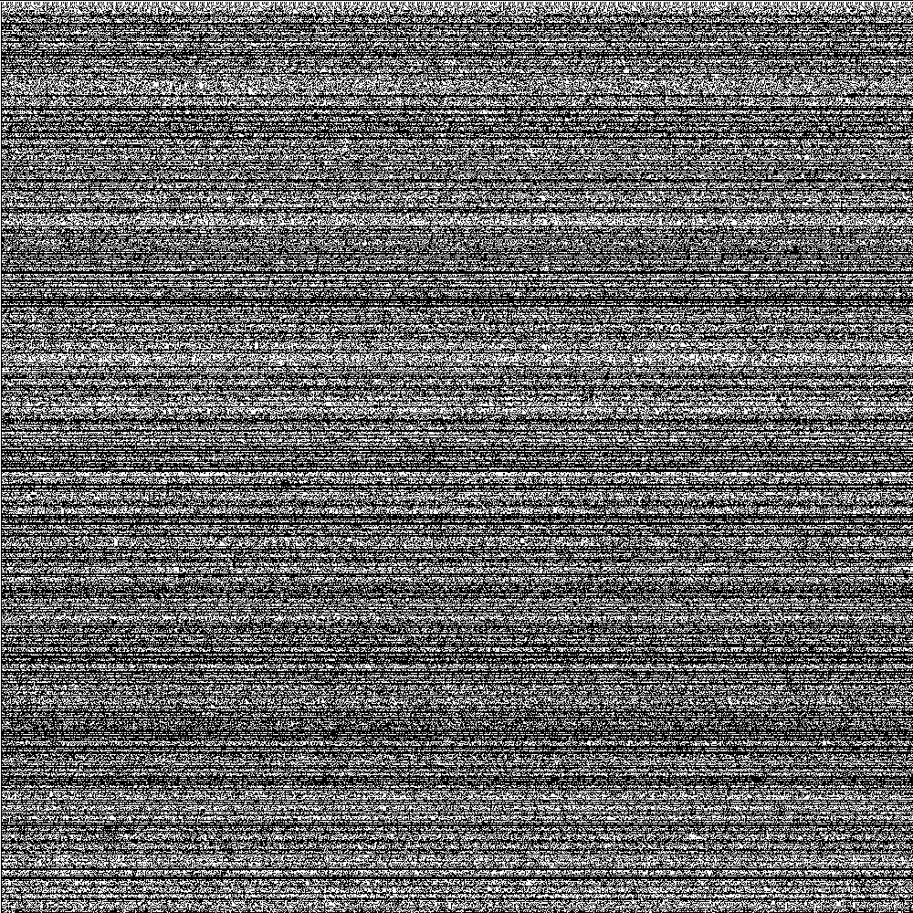

# Squares

Squares is a collection of simple Python functions for drawing an image of squares, or painted pixels, with 
some given logic. It's not particularly optimized, and can paint an image of about 1000x1000 pixels depending on the logic.

## Requirements

* Python 3
* Numpy
* PIL (or PILLOW)

Numpy and PIL can be installed with 
```
pip install numpy
```

and 

```
pip install PILLOW
```

## Getting Started

You can simply clone the repo with 
```
git clone https://github.com/EskoSalaka/Squares.git
```

### Usage examples

For drawing, you only need to use these two following functions:
```
create_squares(first_line, width, height, painter_func, *func_extras, custom_first_line=None, progress=True) 
```

This function creates an array of 1's and 0's of given width and height where 1's represent painted squares. The squares are
painted according to a given function 'painter_func'. The structure of the 'painter_func' is described in more detail
later. Basically, each 'square', or element of the array, is iterated and passed to the 'painter_func', which in
turn either paints the square according to its logic. It is used in the following way:
squares_iterator[0] = painter_func(squares, n, h, x, func_extras)

```
paint(array, square_color, background_color, save_loc='squares.BMP')
```

The paint-function simply converts the given numpy 2d-array to an image data-array and creates an image from it with 
Python's image library PIL.

Lets see a simple example how to paint the 1 000 000 first primes as pixels in a 1000x1000 pixel array.
First, lets define a simple primality checking function:
 
```
def is_prime(n):
    if n % 2 == 0 and n > 2:
        return False
    return 1 if all(n % i for i in range(3, int(math.sqrt(n)) + 1, 2)) else 0
```

We can use it as a painter func in the following way. We only need to use the square number n.

```
white = [255, 255, 255]
black = [0, 0, 0]

# Primes of the first 1 000 000 numbers as squares.
s = create_squares('none', 1000, 1000, lambda array, n, h, x, *extras: is_prime(n))
paint(s, black, white, 'primes_1000x1000.BMP')
```

  
 
 ### Some more or less interesting stuff
 
 ```
 # An interesting kind of Sierpinski-triangles: Paint the square if the sum of the number of painted squares of all
 # the above rows, starting from each row's current column index is even.
 s = create_squares('ones', 1000, 1000, lambda array, n, h, x, *extras: array[:h, x:].sum() % 2)
 paint(s, black, white, 'triangles_1000x1000.BMP')
 ```
 
  
 
  ```
 # Same, but with a random first line
 s = create_squares('random', 1000, 1000, lambda array, n, h, x, *extras: array[:h, x:].sum() % 2)
 paint(s, black, white, 'triangles_random_1000x1000.BMP')
 ```
 
 

 ```
  # Suprisingly, it's hard to see any pattern if we do the same as above but check for divisibility by 3
  # s = create_squares('ones', 1000, 1000, lambda array, n, h, x, *extras: 1 if array[:h, x:].sum() % 3 == 0 else 0)
  # paint(s, black, white, 'div_3_1000x1000.BMP')
 ```

 
 
   ```
 # Color the square if the three above squares are mirror-symmetric starting with a random first line
 def mirror_symmetric_3(array, n, h, x, *extras):
     a = array[h - 1][x - 1]
     c = array[h - 1][x + 1] if x + 1 < array[h - 1].size else array[h - 1][0]
     return 1 if (a and c) or (not a and not c) else 0
 
 
 s = create_squares('random', 1000, 1000, mirror_symmetric_3)
 paint(s, black, white, 'mirror_symmetric_3_1000x1000.BMP')
 ```
 
 

 ```
    # The binary representation of the first 1000 Ulam numbers
    # ulam_num = ulam_numbers(1, 2, 1000)
    s = create_squares('none', 15, 1000, lambda array, n, h, x, *extras: (extras[0][h] & (1 << x)) >> x, *ulam_num)
    paint(s, black, white, 'ulam_binaries_15x1000.BMP')
 ```

 

  ```
    # Paint the square if the current row and column numbers are coprime
    s = create_squares('none', 1000, 1000, lambda array, n, h, x, *extras: math.gcd(h, x) == 1)
    paint(s, black, white, 'coprimes_1000x1000.BMP')
  ```

 

 ```
    # Paint the square if the current square number is comprime withe the product of the row and column numbers.
    # We get some rather interesting squares
    s = create_squares('none', 1000, 1000, lambda array, n, h, x, *extras: math.gcd(n, x*h) == 1)
    paint(s, black, white, 'coprimes3_1000x1000.BMP')
  ```

 

  ```
    # Paint the square if the current row number, column number and square number are all coprime
    s = create_squares('none', 1000, 1000,lambda array, n, h, x, *extras: math.gcd(n, x) == 1 and math.gcd(h, x) == 1 and math.gcd(n, h) == 1)
    paint(s, black, white, 'coprimes2_1000x1000.BMP')
  ```

 

  ```
    # Paint the square if these two following are coprime: number of painted squares of
    # the above rows starting from each row's current column index and ending in it.
    s = create_squares('ones', 1000, 1000, lambda array, n, h, x, *extras: math.gcd(array[:h-1, x:].sum(), array[:h-1, :x].sum()) == 1)
    paint(s, black, white, 'gcd_ones_1000x1000.BMP')
  ```

 

 ```
    # Simple Mandelbrot set
    def mandelbrot(z, max_iterations=1000):
    c = z

    for _ in range(max_iterations):
        if abs(z) > 2:
            return 0
        else:
            z = pow(z, 2) + c

    return 1

    def mandelbrot_set(array, n, h, x, *extras):
        z = complex(-2.0 + 3.0 * x / 1500.0, -1.0 + 2.0 * h / 1000.0)
        return mandelbrot(z, max_iterations=10000)

    s = create_squares('none', 1500, 1000, mandelbrot_set)
    paint(s, black, white, 'mandelbrot_1500x1000.BMP')
  ```

 